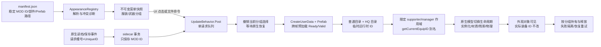
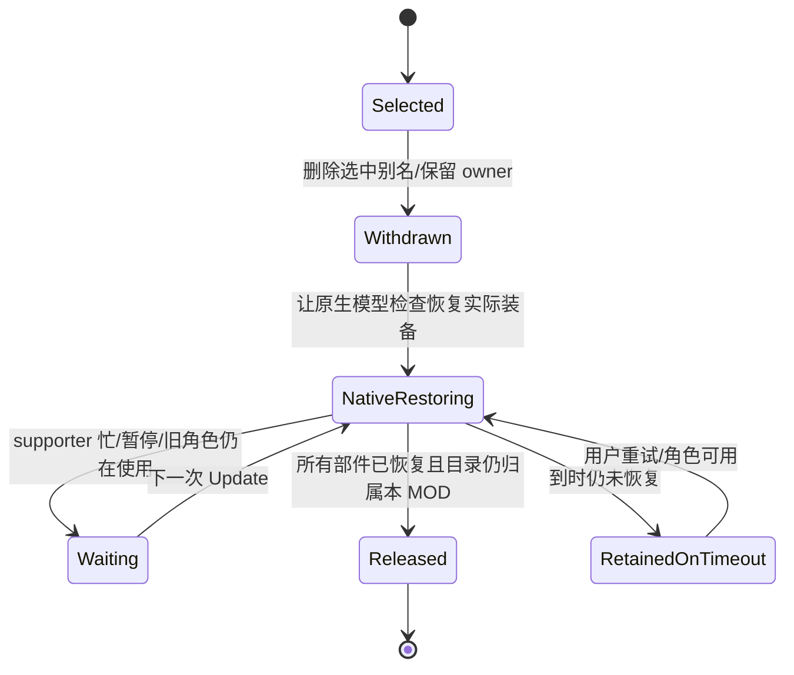
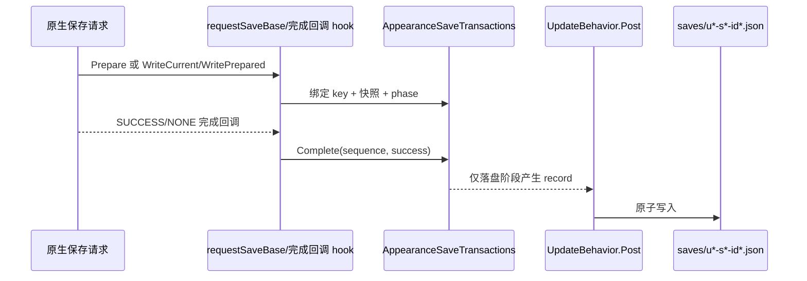

# 鬼武者外观系统架构与《怪物猎人：荒野》迁移研究边界

本文记录当前鬼武者（Onimusha WotS，以下简称 OWOTS）外观系统已经实现、已经由用户实机确认，以及仍然没有被证明的部分，供后续研究《怪物猎人：荒野》（以下简称 MH Wilds）时复用研究方法。本文只依据本地源码、仓库内的运行记录和用户确认，不把另一个游戏的类型名、地址、资源格式或回调语义猜成相同实现。

文中使用三种证据标签：

- **[源码]**：当前仓库源码可以直接定位到的行为。源码能编译不等于已经部署，也不等于画面验收。
- **[实机]**：运行记录或用户人工确认已经证明的行为，范围以记录中的场景为准。
- **[未确认]**：候选代码、离线测试、单次路径或尚未完成的验收；不能当作功能已完成。

## 先读结论

OWOTS 的换装系统本质上是“外观注册表 + 原生模型生命周期扩展 + 独立衣橱/sidecar 管理”，不是把一个 MOD 直接注册成原生装备条目。系统向游戏的玩家部件目录临时增加运行时 Prefab 记录，再在限定的原生模型检查作用域内让游戏查到这些临时 ID；实际装备 ID、原生装备属性和原生存档字段保持由游戏拥有。

已经被用户确认的范围包括：独立 manba 服装资源与 MMI 修正后的材质、所测 CG/HQ 中的外观保持、服装与武器共存、独立两倍武器、独立 ImGui 衣橱 V2，以及卡片高亮修正。槽位 4 的自动恢复在 2026-09-15 复测中人工成功；这证明该次读取链路可完成，不证明所有跨场景、连续读档或早先超时的根因已经查明。

迁移到 MH Wilds 时可以先复用独立 MOD 身份、分组选择、请求队列、sidecar 事务和 UI 交互这些管理层思想，但必须重新调查目标游戏的部件枚举、资源目录、Prefab/模型生命周期、材质依赖、CG 或其他特殊模型链、存档回调和原生菜单。即使 `appearance-core` 也不能零修改移植：其 `AppearanceRegistry.Parts` 直接硬编码了 OWOTS 的部件数字映射。

## 总体机制图



关键边界是：目录扩展让原生模型链能够找到一个临时 Prefab；它没有把该 Prefab 变成 `cCostumeList` 中的原生 ItemID，也没有把临时 ID 写进原生装备或伤害参数。

## 1. MOD 闭包：从描述文件到可用 Prefab

### 1.1 描述文件只保存稳定身份和逻辑资源引用

一个条目使用 `manifest.json` 描述稳定的 MOD ID、显示信息、类型和部件：

```json
{
  "schemaVersion": 1,
  "id": "author.outfit_a",
  "name": "服装 A",
  "kind": "outfit",
  "description": "可选说明",
  "author": "作者",
  "icon": "preview.png",
  "parts": [
    {
      "part": "BODY",
      "catalog": "mods/author/outfit_a/body_catalog.user",
      "prefab": "mods/author/outfit_a/body.pfb"
    }
  ]
}
```

`AppearanceRegistry.Parse` 只验证 JSON、ID、类型、逻辑路径和部件组合；`ReadDirectory/Build` 负责遍历、拒绝坏文件和拒绝重复 ID。它不打开游戏资源，不检查骨骼、动画或武器属性。ID 是持久的 MOD 身份，运行时目录 ID 是本次进程分配的临时别名，二者不能混用。

这里的“资源闭包”比 manifest 的两条路径更大：Prefab 可能继续引用网格、MDF、MMI、纹理、Chain2、约束或其他部件配置。导出或迁移工具必须解析并报告实际引用关系，不能只复制 `mesh + mdf2 + texture` 就声称包完整。

OWOTS 的 manba 诊断首先发现：即使组件的 MDF 路径已经指向 MOD，Prefab 引用的原生 `ModelMaterialInfo`（MMI）仍会把 Base、Normal/Roughness/Occlusion 和褶皱颜色纹理绑定回原生路径。复制并改写独立 MMI 后，运行时材质引用才全部指向独立 MOD 路径。这个结论来自本次 Prefab/MMI 对照，不能推广成所有游戏或所有 MDF 问题的通用回退规则。

因此，OWOTS 的独立资源闭包至少包含：

1. 目录 UserData（`app.user_data.PlayerPartsList`）及其准确的 Prefab 条目。
2. Prefab 所需的 mesh、MDF、MMI 和纹理。
3. 实际使用的物理/动画相关路径，例如已回读的 Chain2；是否复制骨骼和物理文件仍要按资源引用决定。
4. 所有路径的独立命名、版本后缀和包内引用闭合。

`OWOTS_WARDROBE_UI_AND_EXPORT_PLAN.md` 中的导出方案要求用格式解析器改写 Prefab/Catalog/MMI/相关配置引用，并在暂存区做存在性和闭合检查；固定长度字节替换只属于早期私有测试配方，不是通用写入器。

### 1.2 OWOTS 的部件映射是游戏适配代码

当前核心把部件名映射为 OWOTS 数字：

| manifest 部件 | OWOTS `PARTS_TYPE` | 分组 |
| --- | ---: | --- |
| `BODY` | 0 | 服装 |
| `BODY_SUB` | 1 | 服装 |
| `HEAD` | 2 | 服装 |
| `HAIR` | 3 | 服装 |
| `GAUNTLET` | 4 | 服装 |
| `CLOAK` | 5 | 服装 |
| `WEAPON` | 6 | 武器 |
| `SHEATH` | 7 | 武器 |
| `WEAPON_SUB` | 8 | 武器 |
| `SHEATH_SUB` | 9 | 武器 |
| `BOW` | 12 | 武器 |

`AppearanceRegistry.Parts` 和解析时的 `part <= 5` 判定是 OWOTS 规则。MH Wilds 需要重新得到逻辑部件到目标游戏枚举的映射，并确定目标游戏是按整套服装、单件防具、武器/鞘，还是按完全不同的 overlay/slot 组织。不能因为两个游戏都有“身体”和“武器”就复用这些整数。

### 1.3 运行时加载和注册顺序

`OWOTSAppearanceLab` 的注册路径按以下顺序工作：

1. `ReadRegistry` 读取 `reframework/data/owots_appearance_lab/mods`。
2. `BeginRegistered` 为稳定 MOD ID 分配本次会话的 `slot`，然后进入 `BeginTransition`。
3. `BeginTransition` 先校验 manifest，再撤销所选分组的别名；未完成原生恢复时不释放旧资源，也不提前加载新条目。
4. `BeginOutfit`（名称沿用早期探针，实际也处理武器）为每个声明部件创建 `PlayerPartsList` UserData，并把 owner `Globalize` 后放入预加载集合。
5. `PollOutfit` 跨 `UpdateBehavior.Post` 帧寻找与 manifest 路径完全相同的 Prefab，设置 `Standby=true`，等待 `Ready && Valid`。冷加载时目录数组可能暂时为空，不能把第一次返回当成坏资源。
6. 所有部件准备好后，在普通目录和 HQ 目录中检查临时 ID 碰撞，再插入同一个 MOD Prefab，合并到 `s_selectedParts`。
7. 只有注册成功后才发布 `s_activeMods` 和完成响应；预加载失败只释放本次新资源。

普通/HQ 两份目录是 CG/HQ 保持的关键：普通场景查普通目录，CG 等场景可能走 `getPlayerPartsListHQ` 和 `updateLoadModelHQ`。两份目录共用 Prefab 并不代表所有 HQ 生命周期都已经覆盖，仍要实际验证目标游戏的特殊模型链。

## 2. 外观 ID 与实际装备 ID 的分离

### 2.1 作用域别名如何工作

系统不把 `CurrentEquipBodyID`、`CurrentEquipWeaponsID` 等实际装备字段写成 MOD ID。它在已注册 MOD 的运行时映射中保存部件到临时 ID，例如 `s_selectedParts[0] = 900033`，并安装四个有限作用域的 hook：

- `cPlayerGameObjectSupporter.checkModelChange`：只在登记的 supporter 实例上开启外观查找作用域。
- `cPlayerGameObjectSupporter.requestChangeAllModelHQ`：对 HQ 实例化走相同的 supporter 作用域。
- `PlayerManager.updateLoadModelHQ`：对选中的 manager 作用域保留/预加载 HQ 外观。
- `PlayerManager.getCurrentEquipID`：仅在上述作用域内，把当前部件的查询结果替换为 `s_selectedParts` 中的临时外观 ID。

作用域由 `s_visualSupporter`、`s_visualManager` 和 thread-local scope stack 配对。离开原生方法后，`getCurrentEquipID` 返回原生结果。这样原生模型生命周期可以按“当前外观 ID”查目录，保存和实际装备仍看到原生装备。

### 2.2 已确认的分离结果

源码中的 `Equipped` 读取 `Context.Player.CurrentEquip*ID`，没有提供外观系统的装备 setter；`AppearanceChoices` 也只保存 Outfit/Weapon MOD ID。manifest 带有非空 `weaponAttributes` 会被明确拒绝，而不是假装已经注册武器属性。

运行记录确认临时模型 ID 改变时，实际 body、weapon、head、hair、gauntlet、cloak 装备 ID 保持不变。服装与武器可以同时选择，按 `AppearanceKind.Outfit/Weapon` 分组取消时另一组仍保持。用户还确认独立两倍武器的尺寸视觉效果；这只是模型外观验收，不是攻击、伤害、守备、耐久或其他数值验收。

因此，“外观系统注册成功”的含义是：目标部件的原生模型查找链能解析 MOD Prefab 并完成实例化。它不等于：

- 原生服装列表出现了一个新的装备条目；
- 原生 ItemID、解锁条件、名称、图标或预览已经注册；
- 实际装备属性被复制或覆盖；
- 临时模型 ID 可以写入原生存档。

## 3. 原生模型生命周期、MMI/MDF 与资源持有

### 3.1 为什么不用直接 `setMesh`

早期诊断曾对现有 Body/Head/Hair 组件直接调用 `setMesh` 和 `Material`。组件路径回读看似成功，但随后在 `AfterImageMaterialParamRecorder.record` 崩溃；包裹 `AfterImageController.onChangeModelStart/Finish` 的版本虽然进程短时间存活，却出现几何不可见、`WAIT_MONTAGE` 不完成，恢复原资源时又在 MeshBoundary/cloth 更新链崩溃。

这两条命令已在源码路由中禁用。当前正确方向是“注册 Prefab，让游戏自己的 `requestChangeModelCore`、`onChangeModel`、角色级材质/残影/物理更新和完成回调运行”，而不是用 setter 改现有组件指针。路径回读、进程不崩或接口返回 `applied=true` 都不能单独证明视觉成功。

### 3.2 当前资源所有权模型

每个 `OutfitPart` 保存：

- 原始 `PlayerPartsList` UserData owner；
- Prefab 引用及其 `Standby` 状态；
- 临时运行时部件 ID和期望 Prefab 路径；
- 注册时实际的普通/HQ 字典 owner；
- 按 Prefab 地址核验的 `RemoveNormal`/`RemoveHQ` 回调；
- `Registered`/`RegisteredHQ` 状态。

释放时不重新猜当前 manager 的目录，而是使用注册时持有的普通/HQ 字典。只有目录中的同一 ID 仍指向同一 Prefab 才移除；如果被其他代码改写，则报错并保留资源，避免删掉别人的条目。释放逐项推进，部分成功后保留未释放状态，下一次可重试。

撤销流程是：



如果控制角色变了，旧 supporter 的 `_IsDestroy` 是释放旧资源的必要证据之一；新角色的 model ID 不含 MOD ID 不足以证明旧角色已经不再引用。当前代码保存注册 supporter 的 Globalize owner，清理时等待旧 supporter 销毁，再释放最后一组资源。

### 3.3 资源失败和分组隔离

`BeginTransition` 只撤销目标分组。服装和武器的 `s_outfitParts`/预加载集合以及 `MatchesKind` 判定保持独立；`registry_clear kind=weapon` 不应释放服装，反向亦然。若某个武器 Prefab 缺失或 15 秒预加载失败，`ReleasePreload` 只释放这次武器尝试，服装对象地址和网格保持不变；该组留在原生外观，不声称旧 MOD 自动回滚。

这是“分组失败回退”，不是完整的事务回滚：旧组在成功撤销后如果新组加载失败，失败组可能处于原生外观；另一个成功组继续工作。迁移目标游戏时要分别验收这两种语义，不能只看一次整体请求是否返回失败。

## 4. 普通/HQ、CG 与实机证据边界

运行时调查曾先复现普通场景进入 CG 显示原版：supporter 的选择记录仍是 MOD，但实际 Body/Head/Hair 网格走了原生 HQ 路径。随后把 MOD Prefab 也注册到 HQ 目录，并把 `requestChangeAllModelHQ`、`updateLoadModelHQ` 的查找纳入同一外观作用域。用户确认所测 CG 中 MOD 显示正常，退出后常规状态也保持 MOD；MMI 修正后的材质也得到用户确认。

当前能说的是：

- **[实机]** 普通游玩中的 manba 服装与独立纹理正常。
- **[实机]** 用户确认过的一段 CG/HQ 进入、保持和返回正常。
- **[实机]** 服装与两倍武器同时存在，且可单独取消。
- **[未确认]** 所有剧情 CG、所有动作、所有场景转换、跨角色重建、插件卸载以及长时间反复进出 HQ。
- **[未确认]** 早先槽位 4 自动恢复超时的根因；暂停时钟保护是候选保护，不是根因证明。

证据详见 [运行时调查](OWOTS_APPEARANCE_RUNTIME_RESEARCH.md) 和 [人工交接记录](OWOTS_APPEARANCE_HANDOFF.md)。旧记录中的“候选未部署”不能覆盖后续交接中已经明确的部署和用户确认；反过来，后续一次成功也不能抹掉未覆盖场景的边界。

## 5. 独立 ImGui 衣橱、输入和图片预览

### 5.1 线程与请求边界

`DrawMenu` 在 `ImGuiRender.Pre` 中运行，只读 `Volatile` 发布的 `MenuState`。单击、双击、恢复、设置等操作通过 `QueueMenu` 写入一个 UI 请求槽；render callback 不执行原生模型操作。

`UpdateBehavior.Post` 每约 250 ms 处理 startup 设置、sidecar 写入、恢复任务、资源状态、原生菜单同步和文件/UI 请求。请求带 PID 和 ID；启动时只记录已有 `request.json` 的 ID，避免把旧文件命令重放。所有目录插入、Prefab 预加载、撤销、释放和保存写入都在这个游戏更新线程边界执行。

### 5.2 V2 交互语义

用户已确认独立衣橱 V2 的基本功能和卡片高亮修正。当前语义是：

- 单击条目：改变浏览焦点和右侧图片/详情，不换装。
- 双击条目或点击“应用外观”：向同一个更新队列提交 `registry_select`。
- “已应用”和“预览中”是两个状态；应用请求忙或已经应用时禁止重复提交。
- 服装、武器独立浏览和“恢复原版”按类别操作。
- 只需要图片预览，不开发实时 3D 预览；没有图片的条目用同尺寸文字占位。

### 5.3 图标 ABI 和未部署的 boxed-image 候选

核心 manifest 支持相对 PNG/JPEG 路径，但不在解析阶段加载图片。C# 的 `DrawIcon` 在私有 native ABI 不可用、图片无效或句柄失败时绘制占位，因此图片缺失不能阻止换装。

相邻 [REFramework-cn/src/WardrobeIcons.cpp](../REFramework-cn/src/WardrobeIcons.cpp) 的候选 ABI 为 `owots_ui_icon_load/release/draw`：native 侧限制文件大小、像素尺寸和句柄数量，把像素放入 ImGui atlas，释放请求延后到渲染线程收集，并在每次绘制重新读取 atlas UV/TexRef。这个模块有 CPU/图集测试和 Release 构建证据。

**boxed-image DLL（固定方框、等比居中、横竖图留边的候选）尚未安装，不能把它等同于已经部署的游戏行为。** 已安装的组合输入/图标 DLL、C# 衣橱 V2 和未安装的 boxed-image 候选是三个不同验收门。`REFramework::draw_ui` 的 `m_external_ui_active`、窗口消息捕获、DirectInput 忽略/恢复和光标生命周期也必须在目标游戏重新验收。

## 6. 原生菜单同步的真实范围

原生菜单的独立研究入口是 `app.GUI030106` 和 `cCostumeList`。只读反汇编显示：`callback_Decide` 会把选中条目写入菜单暂存设置，`onClose` 又会无条件调用 `applyCostume`。所以“菜单关闭”本身不是用户明确改选的证据。

当前 `NativeCostumeSelections` 只记录：打开会话、明确 `callback_Decide` 的 category、随后 `applyCostume` 的一次消费。OWOTS 映射为 category 0=武器、1/2/3=服装，NPC 类别排除。`native_menu_sync` 的候选在 Update 线程中对明确确认的类别调用已有分组清理，属于“原生明确选择 → 取消对应 MOD 覆盖”的单向同步。

以下内容仍未完成或未验收：

- 把 MOD 条目插入原生 `cCostumeList` 并维护稳定 MOD ID 到原生显示索引的映射；
- 原生名称、说明、锁定条件、图标和预览；
- `applyToPreview` 的菜单预览对象与实际角色对象的生命周期隔离；
- 原生菜单与独立衣橱之间的双向状态同步；
- 把临时 Prefab ID 映射为原生 ItemID/存档身份。

原生菜单因剧情尚未解锁而暂缓实机确认。不能把独立 ImGui 衣橱工作正常、或单向取消候选编译成功，写成原生 MOD 条目已经注册。

## 7. sidecar 保存、读取和身份

### 7.1 保存只记录稳定 MOD 身份

`AppearanceSaveStore` 的记录键是 `UserIndex + Slot + UniqueID`，内容只有 `Outfit` 和 `Weapon` 两个 MOD ID。当前构建接受手动槽 1–20 和自动槽 101。写入先写同目录临时文件并 flush，再 rename 替换；损坏、schema 不支持、内嵌身份不匹配和文件缺失分别处理。native 存档文件不被这个组件改写。

保存适配器不在回调完成时重新读取当前 UI，而是在 `requestUserSaveCore` 入口捕获该请求的槽号、身份和不可变选择快照：



自动保存的 Prepare 阶段即使返回 SUCCESS，也只是为后续 WritePrepared 保留快照；不能立刻提交 sidecar，也不能在后续落盘阶段重新采样选择。失败、取消、未知 flags、换装中或未解决的恢复任务会跳过快照。

### 7.2 读取需要请求槽号和成功身份，而不是最近触碰槽

`requestUserLoadCore` 的 thread-local scope 记录请求槽号；回调构造器只复制 `Result/Error/Detail/TargetData` 标量；请求返回且恰好一个 `SUCCESS/NONE` 后，适配器才重新读取 `LastUserIndex` 与 `UniqueID`，生成 `AppearanceSaveKey`。`LastTouchedSaveSlot` 只用于诊断，不能代替请求时捕获的槽号。

`AppearanceLoadCoordinator` 为每次读档生成递增 ticket。新读档会立刻使旧的待恢复身份失效，即使槽号和 UniqueID 相同；`PollRestore` 在当前原生操作结束后再次检查 ticket、身份和 supporter。恢复阶段依次处理：清理旧外观、服装、武器；每个类别独立产出 issue。缺失 MOD 时 `AppearanceRestorePlan` 回退该类别原版但保留原始 MOD ID，`UnavailableAppearanceIntent` 可在同一用户/UniqueID 的后续保存中保留这个意图，直到用户明确选择或取消。

### 7.3 真实保存和恢复证据

- **[实机]** 槽 4 和自动槽 101 的 sidecar 实际写入过 `local.manba_2` 与 `local.weapon_double`，身份为 user 0 / UniqueID 196596286；写入只作用于私有记录。
- **[实机]** 槽 4 自动恢复曾在 60 秒等待中超时；随后用户恢复运行并重新读取，记录到 `SUCCESS/NONE`、正确身份和无 issue 的 `appearance_restore_finished`，用户确认服装与两倍武器恢复成功。
- **[未确认]** 所有连续读档、不同场景的角色重建、跨周目/覆盖槽语义、缺失 MOD 重新安装后的现场恢复，以及早期超时的根因。

详见 [UI/存档调查](OWOTS_APPEARANCE_UI_SAVE_RESEARCH.md) 和最新 [交接记录](OWOTS_APPEARANCE_HANDOFF.md)。不要把离线 sidecar 单元测试或观察 hook 安装成功写成完整存档集成。

## 8. 哪些层可以迁移到 MH Wilds，哪些层必须重写

### 8.1 可以复用的独立管理层抽象

以下思想与具体 OWOTS 类型无关，适合做成目标游戏适配器上层：

| 管理层抽象 | 可复用内容 | 迁移时仍要确认 |
| --- | --- | --- |
| 稳定 MOD 身份 | ID 规范化、重复 ID 拒绝、描述/作者/图标元数据 | 目标游戏包布局和资源路径语法 |
| 分组选择 | 独立 outfit/weapon 或目标游戏的若干外观类别 | 目标游戏真实部件分组和共存关系 |
| 过渡事务 | 先恢复当前、再预加载新条目、失败隔离、超时重试 | 目标游戏“恢复完成”和“资源可释放”的信号 |
| 资源所有权 | 每次加载保存 owner、按实际容器释放、地址核验、部分失败可重试 | 目标游戏资源引用计数和线程约束 |
| 保存事务 | Prepare/WritePrepared/WriteCurrent、按请求捕获快照、成功回调后写 sidecar | 目标游戏的保存 flags、回调和身份语义 |
| 读档隔离 | sequence/ticket、拒绝迟到完成、等待角色就绪 | 目标游戏是否有多阶段加载、多个玩家/角色 |
| 独立衣橱 | 快照渲染、点击只排队、Update 线程执行模型操作 | 目标游戏输入、渲染、窗口和图片 ABI |

`AppearanceSaveStore`、`AppearanceSaveTransactions`、`AppearanceLoadCoordinator` 都是很好的管理层候选，但它们的键和阶段枚举必须由目标游戏适配器提供证据后才能启用。

### 8.2 必须针对目标游戏重写的适配层

1. **逻辑部件映射**：重写 `AppearanceRegistry.Parts` 或把它抽成 `IGamePartMap`；不能复制 OWOTS 的 0/6/12。
2. **目录和资源类型**：确认目标游戏是否有可修改的部件字典、UserData 类、Prefab 类、Standby/Ready/Valid 语义和 HQ/特殊场景目录。不存在同名 API 时不能套用 `CreateUserData`。
3. **原生模型生命周期**：定位目标游戏实际角色的 request/change/check/finish 链，确认如何触发模型、材质、残影、cloth/physics 和 LOD 更新。不得凭函数名直接调用 setter。
4. **模型身份作用域**：确定“外观 ID 查询”在哪个 native 方法范围内替换，如何绑定当前角色/玩家/manager，并确认实际装备字段和外观查询可以分离。
5. **材质依赖图**：查找目标游戏等价于 MDF/MMI 的材质管理层；必须从运行时材质槽回读最终纹理，不能只检查文件路径或改了 MDF 就结束。
6. **特殊场景链**：重新找 cutscene、HQ、菜单预览、多人/随从、LOD 或其他会替换普通模型的目录与预加载路径。
7. **保存身份与回调**：确认用户、槽位、UniqueID 或目标游戏等价标识的生命周期；确认准备/落盘/成功/取消的回调顺序后再写 sidecar。
8. **原生菜单数据模型**：重新调查分类、列表索引、ItemID、锁定条件、预览对象和确认/关闭副作用。独立 UI 能用不代表原生菜单可注入。
9. **输入与图片渲染 ABI**：确认目标 REFramework 分支、ImGui backend、窗口消息、DirectInput、光标和 atlas 释放路径，不带入 OWOTS 私有 DLL 假设。
10. **资源发布工具**：按目标格式实现结构化解析和引用闭包检查，保留源基线与回滚，不把 OWOTS 的私有固定长度替换脚本当通用转换器。

## 9. MH Wilds 最小研究实验顺序

以下顺序只规定研究方法，不声称 MH Wilds 已支持相同 API，也不要求现在进行实际适配。

### 阶段 A：只读类型和调用图

1. 固定目标游戏版本、REFramework 分支和可重现进程。
2. 只读枚举目标游戏的玩家部件、目录 holder、Prefab/模型 holder、材质管理器、角色 supporter 和保存管理器。
3. 记录每个候选方法的参数、调用者、线程和副作用；区分菜单预览角色与实际角色。
4. 建立目标游戏的逻辑部件表和特殊场景表；没有证据的列标记为未知。

### 阶段 B：资源加载和目录闭包

1. 选一个临时测试 ID，读取现有目录，验证插入、原生查找和删除，前后目录计数必须恢复。
2. 从隔离目录加载一个复制的 UserData/Prefab，跨帧检查 Ready/Valid/引用状态；不实例化、不改装备。
3. 展开 Prefab 的完整引用图，分别确认网格、材质描述、材质管理、纹理、物理和 LOD 路径。
4. 只读回读运行时材质槽的最终纹理路径，证明目标游戏的 MDF/MMI 等价层是否覆盖了包内绑定。

### 阶段 C：单部件原生生命周期

1. 给单一身体或目标游戏最小部件注册临时 alias。
2. 只在一个当前角色/supporter 的模型检查作用域内替换外观查询结果。
3. 让目标游戏自己的模型切换链完成；检查对象新建、材质、残影、物理/cloth、LOD 和完成状态。
4. 前后比较实际装备 ID/属性字段；必须证明外观 alias 没有写装备身份。
5. 撤销 alias，等待原生恢复，再检查目录和资源 owner 归零；暂停、失败、角色销毁都单独记录。

### 阶段 D：整套服装、武器和特殊场景

1. 扩展到一个完整服装条目，确认部件发布是原子可见还是允许部分可见。
2. 叠加一个武器外观，验证服装/武器分别取消、失败不释放另一组。
3. 进入目标游戏的 cutscene/HQ/菜单预览/场景切换/角色重建，观察是否走另一套目录或模型 ID 数组。
4. 回到普通场景并重复进入；只在资源仍被原生使用方释放后注销目录。

### 阶段 E：保存和 UI

1. 先只做保存/读档事件观察，捕获请求槽号、用户身份、结果和回调顺序；不要写 sidecar。
2. 证明同槽覆盖、不同槽、自动保存、新游戏/新周目和失败/取消的身份语义。
3. 再实现按目标身份隔离的 sidecar，先手动保存，再验证读档后预览计划，最后才开启自动恢复。
4. 独立 UI 先接 registry list、图片占位、搜索和请求队列；确认输入捕获/关闭恢复后再接模型操作。
5. 原生菜单最后做，并把“浏览/关闭”和“明确确认”分开验收。没有解锁菜单时不猜测条目注入成功。

## 10. 迁移验收标准

| 层级 | 必须看到的证据 | 不足以通过的替代物 |
| --- | --- | --- |
| 注册表 | 稳定 ID、坏文件隔离、部件映射、重复冲突诊断 | JSON 能解析但没验证目标枚举 |
| 资源加载 | 隔离资源 Ready/Valid，完整引用闭包 | 只看到 Prefab 文件存在 |
| 材质 | 运行时材质槽最终指向预期独立资源 | 只看到 MDF/MMI 文件路径改过 |
| 单部件生命周期 | 原生模型链完成，实际装备身份不变，撤销后资源恢复 | 组件 setter 返回成功或进程暂时没崩 |
| 分组共存 | 服装/武器各自应用、取消和失败隔离 | 只测一套整体换装 |
| 特殊场景 | 每个特殊模型链都显示正确网格和材质，返回后仍可清理 | supporter 仍持有 MOD ID |
| 保存 | 请求槽号、身份、成功回调与 sidecar 键一致 | LastTouchedSlot 变化或文件时间变化 |
| 自动恢复 | 新角色就绪后按最新 ticket 恢复，迟到读档不覆盖新任务 | 编译成功、开关为 true、单次重试路径 |
| UI/图片 | 单击预览、双击应用、缺图占位、输入不穿透、关闭恢复 | 仅 REF 主菜单按钮能调用命令 |
| 原生菜单 | 条目、名称、图标、预览、确认和存档映射完整 | 只实现明确选择后取消 MOD 的单向钩子 |

## 11. 给其他代理的可直接复制研究提示

以下提示适用于 MH Wilds 的本地、只读研究。把 `<目标游戏>`、`<版本>` 和实际文件路径替换后即可使用；每条都要求把事实分为源码证据、实机证据和未确认项。

### 资源与部件映射

```text
请在本地固定版本 <目标游戏>/<版本> 中，只读调查玩家外观部件、目录 holder、Prefab/模型资源和材质管理器。输出：
1. 逻辑部件名到目标游戏枚举/字段的映射表，并列出每一项的源码/元数据定位；
2. 目录读取、插入、原生查找、删除的候选方法及线程/副作用；
3. Prefab 的完整引用闭包，特别是目标游戏等价于 MDF/MMI 的材质管理层；
4. 未知项和最小安全实验。不要假设它有 OWOTS 的 PlayerPartsList、via.Prefab、HQ 目录或相同数字 ID，不要修改游戏文件。
```

### 原生模型生命周期

```text
请只读定位 <目标游戏> 实际玩家模型切换链：请求入口、模型检查、资源预加载、实例化、材质/残影/cloth/physics 更新和完成/释放回调。区分菜单预览对象和实际角色对象。给出一个单部件 alias 实验计划，要求外观查询可被限定到一个 supporter/manager，实际装备身份和属性字段不改变；列出每一步的回读字段、超时处理和释放前提。禁止把直接 setMesh 或接口返回成功当成视觉验收。
```

### 分组失败和场景重建

```text
请设计 <目标游戏> 的 outfit/weapon（或目标游戏等价类别）分组实验：先应用 A，再应用 B，分别取消 A/B，再让一组使用不存在的 Prefab 触发预加载失败。记录对象地址、实际装备 ID、目录计数、资源 owner 和特殊场景模型路径，证明失败不会释放另一组。再测试角色销毁/重建和暂停，明确哪些资源必须保留到原生使用方释放后才能注销。
```

### 保存与读档身份

```text
请在 <目标游戏> 中先只读观察手动保存、自动保存、读档成功、失败和取消：在请求入口捕获用户/槽号/身份，在回调中捕获 result/error/detail，并在请求返回后的 Update 阶段重新采样身份。验证同槽覆盖、不同槽、新游戏/新周目和连续读档。只有证据证明请求槽号和身份稳定后，才设计只保存外观 MOD ID 的 sidecar；不要使用最近触碰槽、内存地址或全局 JSON 猜测身份，不要改原生存档。
```

### 原生菜单与独立衣橱

```text
请分别研究 <目标游戏> 的独立 ImGui 衣橱和原生服装菜单。独立 UI 需要：不可变快照、Update 线程请求队列、单击图片预览、双击应用、缺图文字占位、输入捕获和关闭恢复。原生菜单需要单独确认列表条目、稳定映射、名称/图标/预览、浏览与明确确认、关闭副作用和存档写入。请明确说明“外观目录注册”与“原生装备条目注册”不是一回事；未解锁菜单时不要宣称注入成功。
```

### 验收报告

```text
请把本次 <目标游戏> 外观研究写成三栏报告：
- 源码证据：文件、类型/方法、当前版本和线程边界；
- 实机证据：场景、输入、回读字段、用户视觉确认和可复现步骤；
- 未确认范围：候选代码、未部署 DLL、未覆盖场景、未测属性和可能的根因。
每条结论都说明它是否只证明临时资源目录扩展，还是已经证明原生菜单/装备/存档集成。不要用编译成功替代实机验收。
```

## 12. 本地代码与证据导航

方法名比行号稳定；下面行号以当前工作树为辅助定位，代码变化后应优先按方法名搜索。

| 主题 | 本地导航 |
| --- | --- |
| manifest 解析、OWOTS 部件数字映射、重复 ID | [`appearance-core/AppearanceRegistry.cs`](appearance-core/AppearanceRegistry.cs)：`AppearanceRegistry.Parts`（约 L14）、`Parse`（约 L27）、`ReadDirectory/Build`（约 L78）、`AppearanceChoices.Choose`（约 L111） |
| 保存键、保存事务、恢复计划、缺失 MOD 意图、读档 ticket | [`appearance-core/AppearanceSaveStore.cs`](appearance-core/AppearanceSaveStore.cs)：`AppearanceSaveKey`、`AppearanceLoadCoordinator`、`AppearanceSaveTransactions`、`AppearanceRestorePlan.Create`、`UnavailableAppearanceIntent`、`AppearanceSaveStore` |
| 原生菜单明确确认 ledger | [`appearance-core/NativeCostumeSelections.cs`](appearance-core/NativeCostumeSelections.cs)：`Open`、`Confirm`、`ConsumeApplied`、`Close` |
| 快捷键、卡片模式、持久化/自动恢复开关 | [`appearance-core/WardrobePreferences.cs`](appearance-core/WardrobePreferences.cs)：`Validate/Read/Write` |
| UI V2、图标占位、单击/双击、UI 请求 | [`reframework/plugins/source/OWOTSAppearanceLab.cs`](reframework/plugins/source/OWOTSAppearanceLab.cs)：`DrawMenu`（约 L177）、`DrawWardrobe`（约 L232）、`DrawIcon`（约 L363）、`QueueMenu`（约 L171） |
| 更新线程和命令边界 | 同上：`Update`（约 L482）、`Respond`（约 L589）、`Unload`（约 L443） |
| normal/HQ 目录注册和释放 | 同上：`BeginOutfit`/`PollOutfit`（约 L1615/L1638）、`ReleaseParts`（约 L1719）、`ReleaseOutfit`（约 L1740） |
| 过渡、分组取消、旧 supporter 销毁等待 | 同上：`BeginTransition`、`PollTransition`、`WithdrawSelection`、`ClearBodyAlias`（约 L1515–L1595） |
| 作用域 alias 与 native 模型查询 | 同上：`InstallVisualHooks`（约 L1445）、`BeginVisualScope`、`BeginHQLoadScope`、`BeginVisualLookup`、`EndVisualLookup`（约 L1458–L1481） |
| 保存观察、sidecar 提交、自动恢复 | 同上：`TraceSaveLoads`（约 L1098）、`ConfigurePersistence`（约 L1269）、`PollRestore`（约 L1322）、`CaptureAppearanceSave`（约 L1400）、`FlushAppearanceSaves`（约 L1429） |
| 原生菜单单向同步候选 | 同上：`ConfigureNativeMenuSync`（约 L896）、`PollNativeMenuSync`（约 L952） |
| 直接 mesh/material 失败诊断 | 同上：`ApplyManbaMeshes`/`RestoreMeshes`（约 L781/L828）；路由中 `apply_manba_meshes` 和 `apply_manba_lifecycle` 已明确禁用 |
| 输入捕获与图片 ABI | sibling [`REFramework-cn/src/REFramework.cpp`](../REFramework-cn/src/REFramework.cpp)：`draw_ui`、窗口消息处理；[`DInputHook.cpp`](../REFramework-cn/src/DInputHook.cpp)；[`WardrobeIcons.cpp`](../REFramework-cn/src/WardrobeIcons.cpp)：`owots_ui_icon_load/release/draw` |
| 运行时事实和边界 | [`OWOTS_APPEARANCE_RUNTIME_RESEARCH.md`](OWOTS_APPEARANCE_RUNTIME_RESEARCH.md)、[`OWOTS_APPEARANCE_UI_SAVE_RESEARCH.md`](OWOTS_APPEARANCE_UI_SAVE_RESEARCH.md)、[`OWOTS_APPEARANCE_HANDOFF.md`](OWOTS_APPEARANCE_HANDOFF.md) |
| 衣橱与工作区导出约束 | [`OWOTS_WARDROBE_UI_AND_EXPORT_PLAN.md`](OWOTS_WARDROBE_UI_AND_EXPORT_PLAN.md) |

## 13. 当前未确认项清单

- MH Wilds 是否有可扩展的玩家外观目录、可持有的资源对象和等价的 native 模型生命周期。
- MH Wilds 的逻辑部件、武器/防具共存模型、特殊场景模型链和材质管理格式。
- OWOTS 全部跨场景/跨角色清理、连续读档和缺失 MOD 重装的实机验收。
- 武器伤害、守备、动作、碰撞或其他数值属性是否保持；当前只证明外观和实际装备身份分离，属性研究已暂缓。
- 原生菜单 MOD 条目、名称、图标、预览、双向同步和原生存档映射。
- boxed-image native DLL 的固定图片方框行为；候选未安装，不能与已部署 DLL 混为一谈。

后续代理若只能完成一件事，应先完成目标游戏的“单部件、限定角色、原生生命周期、实际装备身份不变、撤销后资源归还”五项证据，再讨论整套服装、武器、原生菜单或自动恢复。这样可以把可复用的管理层和必须重写的游戏适配层清楚分开。
